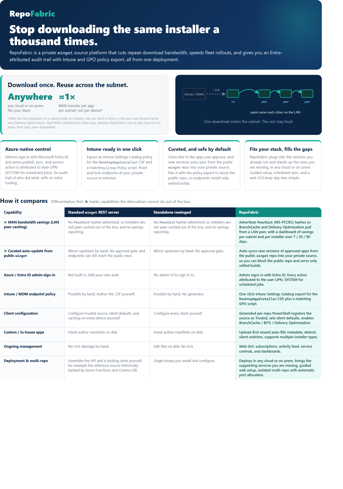

# RepoFabric

A self-hosted, private WinGet source built for Microsoft-managed fleets: native Microsoft Intune and Microsoft Entra ID integration, Azure Arc ready, a GUI admin console, and a REST and PowerShell automation surface for CI/CD. By RingoSystems Heavy Industries.

[](LICENSE)
[](https://github.com/Ringosystems/RepoFabric-Public/actions/workflows/ci.yml)
[](https://hub.docker.com/r/ringosystems/repofabric)
[](https://hub.docker.com/r/ringosystems/repofabric)
[](https://www.powershellgallery.com/packages/RepoFabric.Client)



> **Stop downloading the same installer a thousand times.**
>
> RepoFabric is a private `winget` source platform for Microsoft-managed fleets. Microsoft Entra ID sign-in, one-click Microsoft Intune policy export, Azure Arc support, a GUI admin console, and a REST plus PowerShell automation surface, all from one self-hosted deployment. It also cuts repeat-download bandwidth with LAN peer-caching.
>
> **No license fees, no per-endpoint charges, no subscription.** RepoFabric is free and open source (MIT) and fully self-hosted. You run it on your own infrastructure at any scale, and nothing phones home.

## Where RepoFabric fits

RepoFabric is the **Intune-native admin layer for WinGet**. A bare WinGet REST server just serves manifests; RepoFabric adds what a Microsoft-managed enterprise actually needs on top of it: Microsoft Entra ID sign-in with per-user audit attribution, one-click Microsoft Intune policy export (the `DesktopAppInstaller` CSP plus a matching Group Policy script) to point and lock endpoints at your private source, curated auto-sync from the public `winget` catalog, and a full web console instead of editing manifests on disk.

It is built for Microsoft-first shops:

- **Intune / MDM.** Export a Settings Catalog profile and a GPO script that register RepoFabric as a Trusted source, set silent-install defaults, and optionally turn on BranchCache and Delivery Optimization. Point and lock your fleet in minutes.
- **Azure Arc and hybrid servers.** Arc-enabled servers and other hybrid machines register the same private source and pull a pinned version at policy-enforcement time, so on-prem and multi-cloud Windows hosts install from the source you control.
- **Automated operations and CI/CD.** Everything the GUI does is available headless: a REST API and a 48-cmdlet PowerShell module, git-backed (GitOps) manifests, scheduled unattended sync and retention, and scoped machine-to-machine tokens. Pipelines can query a catalog-read API to check whether a version is present, then publish it. See [Automation and CI/CD](#automation-and-cicd).
- **Genuinely free.** MIT-licensed and fully self-hosted, with no license fees, no per-endpoint or per-seat charges, and no subscription.

If you already run Intune or Azure Arc and want a private, GUI-driven WinGet source that drops straight into your cloud fleet operations, this is that missing piece.

## What it does

RepoFabric mirrors a curated set of packages from `microsoft/winget-pkgs` into your own WinGet REST source, and lets you publish internal-only packages alongside them through a guided browser workflow. End-user endpoints run `winget install <PackageId>` against a single HTTPS URL and download installers from the host you control. The same operator surface manages drift detection, archive snapshots, disaster-recovery drills, and per-virtual-repo promotion.

After the first endpoint on a subnet pulls an installer, the rest fetch it from a LAN peer over Windows BranchCache and Delivery Optimization. One download enters the subnet, the rest stay local.

## Why RepoFabric

- **Azure-native control.** Admins sign in with Microsoft Entra ID, and every publish, sync, and service action is attributed to their UPN (SYSTEM for scheduled jobs). An audit trail of who did what, with no extra tooling.
- **Intune-ready in one click.** Export an Intune Settings Catalog policy for the `DesktopAppInstaller` CSP and a matching Group Policy script. Point and lock endpoints at your private source in minutes.
- **Curated, and safe by default.** Subscribe to the apps you approve, and new versions auto-sync from the public `winget` repo into your private source. Pair it with the policy export to block the public repo, so endpoints install only vetted builds.
- **Fits your stack, fills the gaps.** RepoFabric plugs into the services you already run and stands up the ones you are missing, in any cloud or on-prem. Guided setup, scheduled sync, and a web GUI keep day-two simple.
- **Genuinely free, not freemium.** MIT-licensed and self-hosted, with no license fees, no per-endpoint or per-seat charges, and no subscription. Unlike tools that are free to download but bill you to use them at scale, RepoFabric has no recurring costs. You provide only the host it runs on, and nothing phones home.

## Automation and CI/CD

RepoFabric is built to run without the GUI. Every operation is available programmatically, so it drops into layered CI/CD and GitOps workflows:

- **REST API.** Over 50 endpoints under `/api/*` cover publishing, subscriptions, sync, retention (with a dry-run preview), multi-repo promotion, inventory, drift, backup, and Intune policy export. Authenticate with a Microsoft Entra session or a scoped machine-to-machine bearer token.
- **PowerShell module.** 48 exported cmdlets (`Invoke-RfPublish`, `Sync-RfSubscriptions`, `Get-RfCatalogPresence`, `Get-RfRepoInventory`, `Get-RfCleanupPreview`, and more), all `-WhatIf` and `-Confirm` safe for scripted pipelines.
- **GitOps manifests.** Manifests are declarative YAML in a git (Gitea) backend, committed on every publish, diffable, drift-detected, and revertible, with an append-only publish-events ledger that records the commit SHA and operator identity.
- **Pipeline prerequisite checks.** A `catalog:read` capability token lets a pipeline query `GET /api/v1/catalog/apps/{id}/presence` to confirm a version is available before it references or deploys it.
- **Scheduled, unattended operations.** Built-in jobs sync approved apps from upstream, run retention cleanup, snapshot the manifest store, and detect out-of-band changes, with email alerts if a schedule stops firing.
- **Config as code.** Declarative `docker compose` plus `.env` and YAML configuration, multi-instance aware, with a headless setup path for reproducible, automated stand-up.

## How it compares

Differentiators first. A star (★) marks capabilities the alternatives cannot do out of the box.

| Capability | Standard `winget` REST server | Standalone rewinged | **RepoFabric** |
| --- | --- | --- | --- |
| ★ WAN bandwidth savings (LAN peer-caching) | No `PeerDist` hashes advertised, so installers are not peer-cached out of the box, and no savings reporting. | No `PeerDist` hashes advertised, so installers are not peer-cached out of the box, and no savings reporting. | Advertises `PeerDist` (MS-PCCRC) hashes so BranchCache and Delivery Optimization pull from a LAN peer, with a dashboard of savings per subnet and per installer over 7 / 30 / 90 days. |
| ★ Curated auto-update from public `winget` | Mirror upstream by hand. No approval gate, and endpoints can still reach the public repo. | Mirror upstream by hand. No approval gate. | Auto-syncs new versions of approved apps from the public `winget` repo into your private source, so you can block the public repo and serve only vetted builds. |
| Azure / Entra ID admin sign-in | Not built in. Add your own auth. | No admin UI to sign in to. | Admin signs in with Entra ID. Every action attributed to the user UPN, SYSTEM for scheduled jobs. |
| Intune / MDM endpoint policy | Possible by hand. Author the CSP yourself. | Possible by hand. No generator. | One-click Intune Settings Catalog export for the `DesktopAppInstaller` CSP, plus a matching GPO script. |
| Client configuration | Configure trusted source, silent defaults, and caching on every device yourself. | Configure every client yourself. | Generated per-repo PowerShell registers the source as Trusted, sets silent defaults, enables BranchCache / BITS / Delivery Optimization. |
| Custom / in-house apps | Hand-author manifests on disk. | Hand-author manifests on disk. | Upload-first wizard auto-fills metadata, detects silent switches, supports multiple installer types. |
| Ongoing management | No GUI. Manage by hand. | Edit files on disk. No GUI. | Web GUI: subscriptions, activity feed, service controls, and dashboards. |
| Deployment and multi-repo | Assemble the API and a backing store yourself, for example the reference source historically backed by Azure Functions and Cosmos DB. | Single binary you install and configure. | Deploys in any cloud or on-prem, brings the supporting services you are missing, guided web setup, isolated multi-repo with automatic port allocation. |
| ★ Automation / REST API / CI-CD | Read-only reference API; publishing is manual and out of band. | Read-only REST source; no publish API or CI hooks. | Full REST API (50+ endpoints) plus a 48-cmdlet PowerShell module, GitOps manifests, scheduled sync, and scoped tokens with a catalog-read API for pipeline prerequisite checks. |
| Azure Arc / hybrid servers | Configure every server by hand. | Configure every server by hand. | Arc-enabled and hybrid servers register the same private source and pull a pinned version at policy-enforcement time. |
| Cost | Free and open source. | Free and open source. | Free and open source (MIT). No license fees, no per-endpoint or per-seat charges, no subscription. You provide only the host. |

The full one-pager is at [`docs/marketing/RepoFabric-comparison-onepager.pdf`](docs/marketing/RepoFabric-comparison-onepager.pdf).

## Architecture

Three containers on the host docker network, terminated at a reverse proxy (the bundled Caddy is the greenfield default; bring your own — Nginx Proxy Manager, Traefik, anything that does HTTPS — for the side-by-side / existing-proxy path):

- `repofabric-linux`, the PowerShell module plus Node admin server plus cron plus installer file server, all under supervisord. Bind-mounts state on SSD, manifests and installer cache on bulk storage. Ports `8086` (admin) and `8091` (installers).
- `repofabric-gitea`, the manifest store. One Gitea repo per virtual repo.
- `repofabric-rewinged`, which implements the WinGet REST source protocol against the manifest tree the publisher writes.

Operator browser flow: `https://winget.<domain>/admin/`, then Entra OAuth, then the admin SPA. Endpoint flow: `winget source add` against `https://winget.<domain>/api/...`, manifests are served by rewinged, installer downloads land at `https://installers.<domain>/...`.

## Quick start

You need a Docker host (Engine 24+, `docker compose` v2) and a domain you control.

Not sure which path fits? See [Choose your deployment](docs/deployment.md) for a side-by-side comparison of the three options below.

### One command (fresh host)

If this host will handle HTTPS itself — i.e. nothing else is using ports 80/443:

1. Point a DNS record at the host (e.g. `winget.yourco.com` → its public IP) and make sure inbound TCP **80 and 443** reach it. That's how the certificate is issued automatically.
2. Clone and generate a `.env` beside the top-level `docker-compose.yml`. The helper script prompts for the values and fills in the session secret for you:

   ```bash
   git clone https://github.com/Ringosystems/RepoFabric-Public.git repofabric && cd repofabric
   ./deploy/new-repofabric-env.sh                 # Linux / UNRAID
   # or on Windows:  pwsh ./deploy/New-RepoFabricEnv.ps1
   ```

   Prefer to do it by hand? Copy `.env.example` to `.env` and set three values:

   ```bash
   cp .env.example .env
   # edit .env:
   #   REPOFABRIC_DOMAIN=winget.yourco.com
   #   REPOFABRIC_ACME_EMAIL=you@yourco.com
   #   REPOFABRIC_SESSION_SECRET=   (run: openssl rand -hex 32)
   ```

3. Start it. One command brings up the manifest store, the WinGet API, the admin app, **and a bundled reverse proxy that obtains a real HTTPS certificate automatically** — no proxy to configure, no certs to request:

   ```bash
   docker compose --profile proxy up -d
   ```

4. Open `https://<your-domain>/setup/` and follow the wizard. The manifest store (Gitea) is provisioned for you — no repo to create, no token to paste. For Microsoft sign-in, the **Identity** step generates a ready-to-run Azure CLI script (with your redirect URI already filled in): paste it into [Azure Cloud Shell](https://shell.azure.com) as a tenant admin, run it, and paste the three values it prints back into the wizard. (Creating the app registration needs a Global Administrator / Privileged Role Administrator — that's an Entra requirement, not a RepoFabric one.)

No bootstrap script, no reverse-proxy config, no copying tokens between files.

### Already running a proxy, or want to test side-by-side?

If this host already runs a reverse proxy (e.g. Nginx Proxy Manager) on 80/443, or you want to stand up a second instance **next to a running one on the same host**, start without the bundled proxy (`docker compose up -d`) and front it with your existing one. Full walkthrough — including a fully-isolated test instance beside production — is in [Side-by-side / existing-proxy deployment](linux/admin/static/docs/deploy-sidebyside.md).

Platform-specific guides (UNRAID, Synology, TrueNAS, Portainer) are served by the admin UI at `/docs/` and live under [`linux/admin/static/docs/`](linux/admin/static/docs/).

### Alternative: Sandbox (throwaway, not for production)

For evaluation, demos, or kicking the tires there is a second, deliberately non-enterprise deployment. It is a single all-in-one stack that bundles its own Nginx Proxy Manager and a self-signed certificate, brought up and validated by a guided wizard and wiped with one command. It stays HTTPS-only so the security posture is preserved, but it is explicitly **not** the recommended production method. Full walkthrough in [`sandbox/README.md`](sandbox/README.md).

On the Docker host:

```sh
./sandbox/launch.sh
```

The wizard runs a prerequisites gate, walks you through certificates, local ports, and hostnames, generates the certificate, builds and seeds the stack, completes first-run configuration, proves every endpoint over HTTPS, then prints the steps to finish on your workstation. Throw it all away with `docker compose -f sandbox/docker-compose.yml -p repofabric-sandbox down -v`.

On a populated host like UNRAID, read the [busy-host pre-flight](sandbox/README.md#unraid-and-other-busy-docker-hosts) first: pick a free HTTPS port (443 is usually taken) and check for container-name collisions.

## Container image

The single application image is published to Docker Hub and GitHub Container Registry, and serves every deployment (both production flavours and the Sandbox trial run the same image):

- `docker pull ringosystems/repofabric`
- `docker pull ghcr.io/ringosystems/repofabric`

`latest` tracks the newest release; pin `X.Y.Z` for production. The compose files pull it by default, or build from source with `docker compose build`. Tag list and the full overview are on [Docker Hub](https://hub.docker.com/r/ringosystems/repofabric).

## Endpoints and the PowerShell Gallery

Point Windows endpoints at your private WinGet source with the companion module, [`RepoFabric.Client`](client/RepoFabric.Client/), on the PowerShell Gallery:

```powershell
Install-Module RepoFabric.Client -Scope AllUsers
Register-RfSource -Url https://winget.<your-domain>/api/
Set-RfClientDefault
winget install --source repofabric --id <PackageId>
```

It registers the RepoFabric WinGet source as Trusted, sets silent-install defaults, and, for self-signed or non-standard-port hosts, maps the Local Intranet zone. Free and open source, no per-endpoint charges. For fleet rollout, deploy the same operations through Microsoft Intune instead of running the module by hand (see [`docs/Intune-EndpointConfiguration.md`](docs/Intune-EndpointConfiguration.md)).

## Guides

In-depth guides, also published as a docs site at [ringosystems.com/RepoFabric-Public](https://ringosystems.com/RepoFabric-Public/):

- [Private WinGet source for Microsoft Intune](website/docs/private-winget-source-for-intune.md)
- [Automated WinGet deployment and CI/CD](website/docs/automated-winget-deployment-and-ci-cd.md)
- [WinGet for Azure Arc-enabled servers](website/docs/winget-for-azure-arc.md)

## Where things live

- [`linux/`](linux/), the deployed container. PowerShell module under `linux/src/`, Node admin under `linux/admin/`, container infra at the root.
- [`deploy/`](deploy/), companion compose, bootstrap, migrate script, Intune assets.
- [`sandbox/`](sandbox/), the alternative all-in-one Sandbox deployment (throwaway, not for production).
- [`docs/Intune-EndpointConfiguration.md`](docs/Intune-EndpointConfiguration.md), the endpoint-side Intune profile that registers the WinGet source on managed Windows endpoints.
- `ROADMAP.md`, current and next milestone.
- [`CHANGELOG.md`](CHANGELOG.md), release notes.
- `HANDOFF.md`, orientation for a fresh agent or operator.
- [`CONTRIBUTING.md`](CONTRIBUTING.md), local dev setup and how tests run.

## Status

**0.9.0** is the current release, and the first public release of RepoFabric. It carries client-side bandwidth optimization (PeerDist LAN peer-caching with an Intune endpoint profile and a per-subnet savings dashboard, behind a default-off kill switch), the integrated ConfigFabric sidecar (flag-gated, off by default), repo-aware version retention, and the first phase of a cross-fabric hardening program (per-repo working-tree locking and fail-fast on a half-configured integration). See [`CHANGELOG.md`](CHANGELOG.md) for the full history. Later phases of the cross-fabric program continue in subsequent releases.

## License

MIT, Copyright (c) 2026 RingoSystems Heavy Industries. See [`LICENSE`](LICENSE).

Third-party open-source components and their required notices are listed in
[`THIRD-PARTY-NOTICES.md`](THIRD-PARTY-NOTICES.md). The same notices are surfaced
in the admin UI under **Settings → About**.

## Acknowledgements

RepoFabric stands on excellent open-source work. The following are credited with
thanks (this is a courtesy acknowledgement; the legally-required notices live in
[`THIRD-PARTY-NOTICES.md`](THIRD-PARTY-NOTICES.md)):

- [WinGet manifest schemas](https://github.com/microsoft/winget-cli) by Microsoft — vendored under MIT for client- and server-side manifest validation.
- [rewinged](https://github.com/jantari/rewinged) by jantari — the WinGet REST source server RepoFabric orchestrates.
- [Gitea](https://github.com/go-gitea/gitea) — the manifest store.
- [Nginx Proxy Manager](https://github.com/NginxProxyManager/nginx-proxy-manager) — supported as a bring-your-own reverse proxy for the side-by-side / existing-proxy path.
- [KiloCode](https://github.com/Kilo-Org/kilocode) — the AI coding tool used during development (dev-time only; not distributed).
